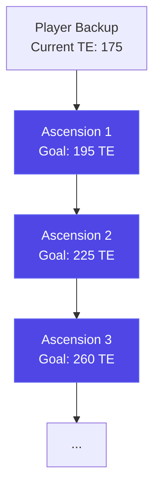

# Automatic Ascension Planner — Spec v5

## 1. The System

A **sequential ascension plan builder** that lets a user construct their own multi-ascension roadmap toward a target TE. The user adds ascensions one at a time, choosing the TE goal for each. Each ascension's end state (end date/time, end TE, SE balance, shift count) automatically becomes the start state of the next. The user can go back and change an earlier ascension's goal, and everything downstream recalculates.



The tool does **not** auto-generate or branch. The user is in full control of:
- How many ascensions to plan
- What TE goal each ascension targets
- Whether to use a 1-sale or 2-sale build phase (the tool simulates both and recommends the faster one)

---

## 2. User Inputs

### Global Inputs (top of the form)

| Input | Type | Constraints | Description |
|---|---|---|---|
| **Player ID** | string | Required | Loads raw backup |
| **Initial TE** | per-egg breakdown | Auto-populated from backup | Eggs delivered + TE earned per egg, editable |
| **Ascension Start Time** | datetime + timezone | Defaults to now | When the first ascension begins |
| **Timezone** | timezone selector | Defaults to browser tz | Reused from initial state tab |

### Per-Ascension Input

After each generated ascension overview, a goal input appears for the next ascension. The user can specify **either** a TE goal **or** a date/time goal — whichever they provide, the tool calculates the other:

| Input | Type | Constraints | Description |
|---|---|---|---|
| **TE Goal** | integer | Min: `previousEndTE + 10`, Max: `490` | Target TE for the next ascension |
| **End Date/Time** | datetime | Min: previous ascension's end time | Target end date (uses same timezone as global start time) |

The user fills in **one** of these fields. The tool then:
1. Simulates both 1-sale and 2-sale build strategies
2. Picks the faster/better strategy
3. Back-populates the other field (either the resulting end date for a TE goal, or the achievable TE for a date goal)

If the user later changes one field, the tool re-evaluates the 1-sale vs. 2-sale decision and recalculates the TE-wait shifts. The build phase (C1→K3) does **not** need to be re-simulated since the ascension's start time hasn't changed — only the wait phase durations change.

The minimum gain of 10 TE per ascension is enforced — smaller gains are always more efficient as extensions of the previous ascension.

### Pre-Calculation Display

Before generating the first ascension, show:
- **Current TE**: from backup (earned + pending)
- **TE to gain**: `targetTE - currentTE` (where targetTE is the per-ascension goal)

---

## 3. Sequential Plan Flow

### How It Works

1. **User sets global inputs** (player ID, start time, timezone, initial TE)
2. **User sets their first goal** (either TE target or end date) and clicks Generate
3. **Tool simulates both 1-sale and 2-sale builds**, picks the best, back-populates the other goal field, and shows the `AscensionOverview`
4. **Below the overview**, a new goal input appears for the next ascension
5. **User enters a goal and generates** — the tool uses the previous ascension's end time, end TE, ending SE, and ending shift count as the start state
6. **Repeat** until the user reaches 490 TE or stops adding ascensions

### State Chaining

Each ascension's output state becomes the next ascension's input state:

| Property | Source |
|---|---|
| `startTime` | Previous ascension's `endTime` |
| `startTE` | Previous ascension's `endTE` |
| `startSoulEggs` | Previous ascension's `endSoulEggs` |
| `startShiftCount` | Previous ascension's `endShiftCount` |
| `eggsDelivered` | Reset to 0 per egg (new ascension = new farm) |
| `teEarned` | Previous ascension's `finalTE` per egg |
| `researchLevels` | Reset to `{}` (new ascension) |
| `bankValue` | Reset to 0 (new ascension) |
| `population` | Reset to 1 (new ascension) |
| `currentEgg` | Reset to `curiosity` (C1 start) |

> [!IMPORTANT]
> `eggsDelivered` resets per ascension because you start a new farm. But `teEarned` carries over because TE is permanent. The engine uses `teEarned` (not `eggsDelivered`) to determine starting TE for the next ascension's build phase.

### Cascading Recalculation

If the user changes the goal (TE or date) of ascension N (where there are M > N total ascensions):
- **Ascension N**: Only the TE-wait phase is recalculated (build phase C1→K3 is unchanged since start time didn't change). The 1-sale vs. 2-sale decision is re-evaluated. The other goal field is back-populated.
- **Ascensions N+1 through M**: Fully re-simulated using updated start states from the chain (new start time, new start TE, updated SE/shift count). Each downstream ascension keeps its existing goal but recalculates everything else (timing, SE costs, ELR, build strategy).

This ensures the plan stays internally consistent. A change to an early ascension that shifts the start date for later ones will change which research sales those later ascensions can access, potentially changing their optimal build strategy and requiring full re-simulation of the build phase.

---

## 4. The 13-Shift Ascension Template

> [!IMPORTANT]
> Every ascension follows this exact 13-shift sequence. Artifacts start as earnings set.

| # | Egg | Label | Strategy | Time |
|---|---|---|---|---|
| 1 | Curiosity | **C1** | Buy cheap research to unlock tiers → fleet_size research → graviton_coupling → earnings research (ROI order) | ≤ 30 min |
| 2 | Kindness | **K1** | Buy vehicles to maximize earnings first (shipping ≥ lay rate). Then buy biggest vehicles/trains for max shipping capacity. No intermediate vehicles. | ≤ 30 min |
| 3 | Integrity | **I1** | Buy 4 Chicken Universes | Variable |
| 4 | Curiosity | **C2** | Finish fleet_size research if needed. Buy graviton_coupling. | Few min |
| 5 | Kindness | **K2** | Max all vehicles and trains. | Variable |
| 6 | Resilience | **R1** | Buy as many silos as possible | ≤ 1 hr |
| 7 | Curiosity | **C3** | **Phase A**: Earnings ROI research → **Phase B**: ELR Impact research. Duration anchored to final research sale. See §8.5 for full strategy. | Variable (sale-anchored) |
| 8 | Humility | **H1** | Switch to optimal ELR artifacts (existing `getOptimalELRSet`) | Instant |
| 9 | Kindness | **K3** | Buy last vehicles/trains. **Wait for TE.** *(1st TE-earning shift)* | Variable |
| 10 | Curiosity | **C4** | Wait for TE *(2nd TE-earning shift)* | Long |
| 11 | Integrity | **I2** | Wait for TE *(3rd TE-earning shift)* | Long |
| 12 | Resilience | **R2** | Wait for TE *(4th TE-earning shift)* | Long |
| 13 | Humility | **H2** | Wait for TE *(5th TE-earning shift)* | Long |

**Max ELR is determined after K3 completes its purchases (shift 9).** H1 switches to ELR artifacts *before* K3, so K3's purchases are made with the ELR set already equipped.

### TE-Earning Shifts

- **5 total TE-earning shifts**: K3 (after purchases), C4, I2, R2, H2
- Shifts 10-13 (C4/I2/R2/H2) are in **any order** — they're all just waiting for TE
- K3 earns TE while waiting after its purchases are complete

### Events During Simulation

| Event | Schedule | Effect |
|---|---|---|
| **Monday 2× Earnings** | Mon 9 AM PT → Tue 9 AM PT | `earningsBoost.active = true, multiplier = 2` |
| **Friday Research Sale** | Fri 9 AM PT → Sat 9 AM PT | `activeSales.research = true` (70% off) |

The auto-planner must track simulation time and apply/remove events as the clock crosses these boundaries.

---

## 5. TE ≥ 100 Simplification

**All players using this tool have ≥ 100 TE.** This allows:

- **Population = hab capacity** at all times (IHR so high habs fill instantly)
- **Earnings = flat rate** (no population growth integration)
- **Time to save = `price / offlineEarnings`** (simple division)
- **Skip `wait_for_full_habs` actions entirely**
- **Skip population growth modeling** in `computeSnapshot`

---

## 6. Engine Integration (No Duplication)

Reuse the existing engine — no separate engine file:

```typescript
// Use existing computeSnapshot with skipGrowth option
const snapshot = computeSnapshot(engineState, context, { skipGrowth: true });

// Simplified time-to-save (TE ≥ 100 means flat earnings)
function fastTimeToSave(price: number, snapshot: CalculationsSnapshot): number {
  const available = snapshot.bankValue;
  if (available >= price) return 0;
  const earnings = snapshot.offlineEarnings;
  if (earnings <= 0) return Infinity;
  return (price - available) / earnings;
}
```

Key functions reused directly:
- `computeSnapshot()` — with `skipGrowth: true`
- `applyAction()` — pure state transitions
- `getDiscountedVirtuePrice()` — research pricing
- `getCommonResearches()`, `isTierUnlocked()` — research definitions
- `calculateArtifactModifiers()` — artifact effects
- `getOptimalELRSet()` — optimal ELR artifact selection
- `calculateMaxVehicleSlots()`, `calculateMaxTrainLength()` — vehicle research queries
- `shiftCost()` — SE cost per shift
- `getNextPacificTime()` — event calendar
- `computeRealisticELR()` — exists in `useResearchViews.ts`, extract to shared utility

### What We DON'T Reuse
- Vue composables — UI-coupled
- Pinia stores — auto-planner works with pure `EngineState` objects
- Full simulation pipeline (`simulate.ts`) — we generate actions, not replay them

---

## 7. AscensionSummary: Lightweight Result

```typescript
interface AscensionSummary {
  id: string;
  parentId: string | null;
  depth: number;                          // 0-indexed ascension number
  
  // Timing
  startTime: number;                      // Unix timestamp (seconds)
  endTime: number;                        // Unix timestamp (seconds)
  totalDurationSeconds: number;
  
  // Build phase info
  buildPhaseEndTime: number;              // When build phase ended (sale boundary)
  buildPhaseSaleCount: 1 | 2;             // Which sale boundary was used
  
  // Key metrics at END of ascension
  startTE: number;
  endTE: number;
  teGained: number;
  maxELR: number;                         // Peak ELR after K3 purchases (eggs/second)
  
  // SE tracking
  startSoulEggs: number;
  endSoulEggs: number;                    // After 13 shifts deducted (may be negative)
  startShiftCount: number;
  endShiftCount: number;                  // startShiftCount + 13
  totalShiftCost: number;                 // Sum of 13 shift costs
  
  // Per-egg summary
  eggsDelivered: Record<VirtueEgg, number>;
  teEarned: Record<VirtueEgg, number>;    // Gained during this ascension
  finalTE: Record<VirtueEgg, number>;     // Total after ascension
  
  // Strategy label for display
  strategyLabel: string;                  // e.g., "1-sale build"
  
  // Max ELR milestone flag
  isMaxELRAscension: boolean;             // True if this is the ~300 TE collapse
}
```

---

## 8. TE Earning Mechanics

TE is earned by delivering eggs past thresholds. The thresholds are defined in `src/lib/truthEggs.ts` — 98 breakpoints per egg in the `TE_BREAKPOINTS` array (from 5e7 to 3.655e19 eggs delivered). Key utilities:

- `countTEThresholdsPassed(delivered)` — how many TE earned for a given eggs-delivered count
- `nextTEThreshold(delivered)` — eggs needed for the next TE
- `eggsNeededForTE(currentDelivered, targetTE)` — eggs remaining to reach a specific TE number
- `pendingTruthEggs(delivered, earnedTE)` — pending (unclaimed) TE
- `MAX_TE = 98` per egg, `MAX_TOTAL_TE = 490`

### During TE-Earning Shifts (K3, C4, I2, R2, H2)

After the build phase, ELR is constant (max ELR after K3). TE earning is a simple linear calculation:

1. **Eggs delivered per second** = max ELR (constant)
2. **Time to cross threshold N**: `(TE_BREAKPOINTS[N] - currentEggsDelivered) / maxELR`
3. **Total TE in time `t`**: count thresholds crossed by `currentEggsDelivered + maxELR × t`

### During Build Phase (C1 through K3)

> [!WARNING]
> During the build phase, ELR changes with every action (research purchased, vehicle bought, artifact swap). TE is still being earned from eggs delivered at the *current* ELR. The auto-planner must track cumulative eggs delivered as the build phase progresses, using the ELR at each point in time, not a constant rate.

---

## 9. K1 Strategy Clarification

### Goal
Maximize shipping capacity within ≤ 30 minutes. Do NOT buy intermediate vehicles that don't increase earnings.

### Algorithm
```
Phase 1: Get shipping ≥ lay rate (maximize earnings)
  - Buy the minimum vehicles needed so shipping capacity ≥ lay rate
  - This unlocks maximum earnings for saving
  - Skip intermediate vehicle tiers — go straight to the most efficient option

Phase 2: Save and buy biggest (remaining time in ≤ 30 min)
  - With earnings now maximized, compute what vehicles/trains are affordable
  - Buy the combination that gives highest total shipping capacity
  - Don't buy intermediate vehicles just to replace them — 
    skip to the best vehicle you can afford in the time remaining
```

---

### 8.5 C3 Strategy — Full Specification

C3 is the longest and most impactful Curiosity shift. Its duration is anchored to the **final research sale** of the build phase. Two main steps:

#### Step 1: Buy Earnings Research

Buy earnings-relevant research (same filter as ROI view — exclude IHR, hab capacity, running chicken bonus, hatchery refill) sorted by **Earnings ROI**.

For each candidate, evaluate two conditions:

- **Condition A**: The research will achieve **70% ROI** before the **start of the next research sale**
  - Formally: `earningsDelta × (nextSaleStart - purchaseTime) ≥ 0.7 × price`
- **Condition B**: The research will achieve **100% ROI** before the **end of the build phase**
  - Formally: `earningsDelta × (buildPhaseEnd - purchaseTime) ≥ price`

Decision matrix:

| A | B | Action |
|---|---|---|
| ✅ | ✅ | **Buy now** — it pays for itself and earns 70% back before the sale discount would matter |
| ❌ | ✅ | **Buy at the start of the next research sale** — wait for the 70% discount, it still pays off before the build phase ends |
| ❌ | ❌ | **Never buy** — it won't pay for itself even by the end of the build phase |
| ✅ | ❌ | *(Impossible — if 70% ROI is reached before the sale, 100% ROI is reached shortly after, which is before build phase end in any practical case. Treat as "never buy" if it somehow occurs.)* |

Continue buying earnings research (in ROI order) until no more candidates satisfy A or B.

> [!NOTE]
> Don't forget to track the **Monday 2× earnings event** during C3. When active, earnings double, which affects both the time-to-save for purchases and the ROI calculations.

#### Step 2: Buy ELR Research

Wait for the **final research sale** to start (Friday 9 AM PT), then buy ELR research:

- View: **ELR Impact, Realistic mode** (optimal ELR artifacts, max habs/vehicles assumed)
- Sort: **Time Efficiency** (`hpp` — hours per percentage point of ELR improvement)
- Buy the best time-efficiency research first
- Continue buying until the sale ends (Saturday 9 AM PT)

This uses the `computeRealisticELR` function (to be extracted from `useResearchViews.ts`).

**Edge case**: Some ELR research may *also* meet Conditions A and B from Step 1 (i.e., it improves earnings enough to pay for itself before the build phase ends). In that case, **buy it immediately** during Step 1, don't wait for the sale.

#### C3 Timeline Example

```
C3 starts (e.g., Wednesday)
│
├─ Step 1: Earnings ROI research
│  ├─ Buy A+B candidates now
│  ├─ Queue !A+B candidates for sale start
│  ├─ Skip !A+!B candidates entirely
│  └─ Check ELR research for A+B edge case → buy immediately if found
│
├─ Monday 9 AM PT: 2× earnings event (if applicable)
│  └─ Earnings double → recalculate ROI for remaining candidates
│
├─ Friday 9 AM PT: Final research sale begins
│  ├─ Buy queued !A+B earnings research at 70% off
│  └─ Step 2: Buy ELR Impact research (Realistic, Time Efficiency)
│
└─ Saturday 9 AM PT: Sale ends → C3 complete → shift to H1
```

---

## 10. Architecture

```
src/auto/
  ├── AGENT.md                 ← Agent instructions
  ├── PLAN.md                  ← This file: feature specification
  ├── IMPLEMENTATION.md        ← Step-by-step implementation plan
  ├── types.ts                 // AscensionSummary, etc.
  ├── ascension.ts             // Generate one ascension
  ├── calendar.ts              // Event schedule helpers
  ├── se-tracker.ts            // SE & shift count tracking across ascensions
  ├── te-thresholds.ts         // TE threshold crossing calculations
  ├── engine/                  // Engine utilities (strategist, eggs calc)
  ├── shifts/                  // Individual shift strategies
  │   ├── index.ts
  │   ├── c1.ts through te-wait.ts
  └── extract.ts               // Pure functions extracted from UI composables

src/components/auto/
  ├── AutomaticPlanner.vue     // Main auto planner: inputs + chain of ascensions
  ├── AscensionOverview.vue    // Single ascension result display
  └── ShiftSummary.vue         // Individual shift detail view
```

---

## 11. Export

### Plan Library Export

The user can export their entire ascension chain as a plan library file (JSON). This file contains:
- Global metadata (player ID, start time, timezone)
- An ordered array of ascension entries, each with:
  - TE goal
  - The full `Action[]` array
  - The `AscensionSummary`

### Import Back to Manual Planner

An exported plan can be loaded back into the manual planner via "Load Saved Plan." Each ascension in the chain becomes a separate plan entry. The manual planner can replay all actions to verify correctness.

### Copy / Share

A lightweight text summary (no actions, just the roadmap) can be copied to clipboard:
```
Ascension Plan — Starting TE: 175
  A1: 175 → 195 TE (1-sale, 6d 12h) 
  A2: 195 → 225 TE (2-sale, 8d 3h)
  A3: 225 → 260 TE (1-sale, 5d 18h)
  ...
Total: 175 → 490 TE in ~45 days
```

---

## 12. Open Questions

All questions have been resolved. ✅

| Question | Resolution |
|---|---|
| **C3 Logic** | Fully specified in §8.5 — Earnings ROI with A/B condition matrix → ELR Impact during final sale |
| **~300 TE Threshold** | Varies by player, computed dynamically per build phase |
| **TE Thresholds Data** | `src/lib/truthEggs.ts` — `TE_BREAKPOINTS` array + existing utilities |
| **Decision tree vs. manual** | Abandoned decision tree — user builds their own sequential plan |
