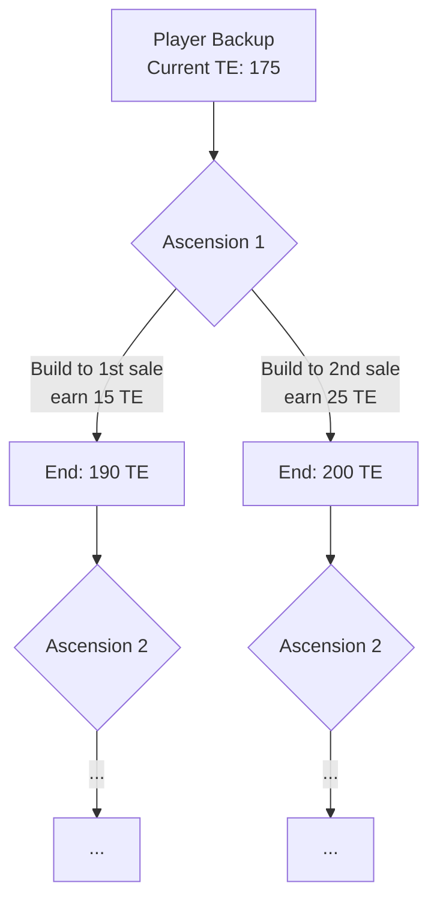

# Automatic Ascension Planner — Spec v4

## 1. The System

A **multi-ascension decision tree optimizer** that takes a player's current state and a target TE, then generates candidate ascension sequences to reach that goal. The user explores the tree, picks preferred paths, and exports them as a plan library.



---

## 2. User Inputs

| Input | Type | Constraints | Description |
|---|---|---|---|
| **Player ID** | string | Required | Loads raw backup |
| **Target TE** | integer | Min: `currentTE + pendingTE + 1`, Max: `490`, **Default: 490** | Long-term goal |
| **Max Ascensions** | integer | Min: `1`, Max: `ceil((targetTE - currentTE) / 10)` ≤ 39 | How deep the tree can go |
| **Ascension Start Time** | datetime + timezone | Defaults to now; **timezone selector** reused from initial state tab | When the first ascension begins |

### Pre-Calculation Display

Before generating, show the user:
- **Current TE**: from backup (earned + pending)
- **TE to gain**: `targetTE - currentTE`
- **Max total SE spent**: cumulative SE consumed by `maxAscensions × 13` shifts, computed iteratively with `shiftCost(soulEggs, shiftCount)` deducting as it goes
- **SE remaining after max ascensions**: `soulEggs - totalCost` (may be **negative** — that's OK, player may plan to earn more SE)

The `shiftCost` formula (from `lib/earning_bonus.ts`):
```typescript
shiftCost(numSoulEggs, shiftCount) = 10^11 + 0.6 * basis + (0.4 * basis)^0.9
// where basis = numSoulEggs * (0.02 * (shiftCount / 120)^3 + 0.0001)
```

> [!NOTE]
> Since shift cost is a percentage of SE and both the percentage and remaining SE change with every shift, you can't show a per-ascension cost. Show only the **max total SE spent** across all planned ascensions, computed by iterating shift-by-shift.

> [!WARNING]
> SE going negative is allowed. Players may plan to earn more SE between ascensions. Display the negative value clearly but don't block generation.

---

## 3. Decision Tree Branching

Each ascension node has **two** branching dimensions:

### Branch Point 1: Build Phase Length

The "build phase" (shifts C1 through K3, where you determine max ELR) is anchored to the **Friday 9 AM Pacific research sale**:

- **Option A**: Build phase ends at end of the **1st** research sale after ascension start
- **Option B**: Build phase ends at end of the **2nd** research sale after ascension start

This changes how much time C3 (the big earnings→ELR research shift) gets, which directly impacts max ELR and therefore TE earning speed.

The research sale timing uses `getNextPacificTime(5, 9, timestamp)` from `lib/events.ts` — Friday = day 5, hour 9.

### Branch Point 2: Ending TE

After the build phase, the remaining shifts earn TE. The number of TE earned is variable. For each possible ending TE value:

- Different ending TE → different starting TE for next ascension → different ELR/earnings potential
- Higher TE earned = longer ascension = later start for next ascension

> [!IMPORTANT]
> **Minimum 10 TE per ascension.** No branch should gain fewer than 10 TE — it would be more efficient to wait longer on the previous ascension.

### The ~300 TE Threshold: Max ELR Milestone

> [!TIP]
> Somewhere around **~300 TE**, a player can purchase **all** research that affects egg laying rate and shipping capacity. At that point, the player's ELR is permanently maxed — no future ascension can improve it.

When the auto-planner detects that a player can achieve this milestone (all ELR/shipping research purchasable within a single build phase), the tree **collapses**. Instead of generating more branching ascensions, it produces **one final long ascension** that goes from ~300 TE all the way to the target (up to 490). This ascension's build phase achieves max ELR, and then the remaining shifts just wait for TE at the maximum possible rate.

This is a massive simplification — no more branching needed after this point.

### Pruning

Only two pruning rules:

| Rule | Effect |
|---|---|
| **TE gain < 10** | Prune — always inefficient, better to extend previous ascension |
| **Target TE reached** | Stop — this is a complete path, no further branching |

No other pruning. In particular:
- **SE going negative is allowed** (player may earn more)
- **No duration limit** (except 490 TE cap = 98 per egg)
- **No dominated-path pruning** (speed isn't always the goal — player may want TE sooner for other game benefits)

### Build Phase Optimization

> [!TIP]
> The build phase (C1 through K3) is **identical** for any ascension starting at the same timestamp with the same TE, regardless of how long the TE-waiting phase will take afterward. This means we compute the build phase **once** per (timestamp, TE) pair and reuse it across all ending-TE branches. Only the TE-wait phase varies.

---

## 4. The 13-Shift Ascension Template

> [!IMPORTANT]
> Every ascension follows this exact 13-shift sequence. Artifacts start as earnings set.

| # | Egg | Label | Strategy | Time |
|---|---|---|---|---|
| 1 | Curiosity | **C1** | Buy cheap research to unlock tiers → fleet_size research → graviton_coupling → earnings research (ROI order) | ≤ 30 min |
| 2 | Kindness | **K1** | Buy vehicles to maximize earnings first (shipping ≥ lay rate). Then buy biggest vehicles/trains for max shipping capacity. No intermediate vehicles. | ≤ 30 min |
| 3 | Integrity | **I1** | Buy 4 Chicken Universes | Variable |
| 4 | Curiosity | **C2** | Finish fleet_size research if needed. Buy graviton_coupling. | Few min |
| 5 | Kindness | **K2** | Max all vehicles and trains. | Variable |
| 6 | Resilience | **R1** | Buy as many silos as possible | ≤ 1 hr |
| 7 | Curiosity | **C3** | **Phase A**: Earnings ROI research → **Phase B**: ELR Impact research. Duration anchored to final research sale. See §8.5 for full strategy. | Variable (sale-anchored) |
| 8 | Humility | **H1** | Switch to optimal ELR artifacts (existing `getOptimalELRSet`) | Instant |
| 9 | Kindness | **K3** | Buy last vehicles/trains. **Wait for TE.** *(1st TE-earning shift)* | Variable |
| 10 | Curiosity | **C4** | Wait for TE *(2nd TE-earning shift)* | Long |
| 11 | Integrity | **I2** | Wait for TE *(3rd TE-earning shift)* | Long |
| 12 | Resilience | **R2** | Wait for TE *(4th TE-earning shift)* | Long |
| 13 | Humility | **H2** | Wait for TE *(5th TE-earning shift)* | Long |

**Max ELR is determined after K3 completes its purchases (shift 9).** H1 switches to ELR artifacts *before* K3, so K3's purchases are made with the ELR set already equipped.

### TE-Earning Shifts

- **5 total TE-earning shifts**: K3 (after purchases), C4, I2, R2, H2
- Shifts 10-13 (C4/I2/R2/H2) are in **any order** — they're all just waiting for TE
- K3 earns TE while waiting after its purchases are complete

### Events During Simulation

| Event | Schedule | Effect |
|---|---|---|
| **Monday 2× Earnings** | Mon 9 AM PT → Tue 9 AM PT | `earningsBoost.active = true, multiplier = 2` |
| **Friday Research Sale** | Fri 9 AM PT → Sat 9 AM PT | `activeSales.research = true` (70% off) |

The auto-planner must track simulation time and apply/remove events as the clock crosses these boundaries.

---

## 5. TE ≥ 100 Simplification

**All players using this tool have ≥ 100 TE.** This allows:

- **Population = hab capacity** at all times (IHR so high habs fill instantly)
- **Earnings = flat rate** (no population growth integration)
- **Time to save = `price / offlineEarnings`** (simple division)
- **Skip `wait_for_full_habs` actions entirely**
- **Skip population growth modeling** in `computeSnapshot`

---

## 6. Engine Integration (No Duplication)

Reuse the existing engine — no separate engine file:

```typescript
// Use existing computeSnapshot with skipGrowth option
const snapshot = computeSnapshot(engineState, context, { skipGrowth: true });

// Simplified time-to-save (TE ≥ 100 means flat earnings)
function fastTimeToSave(price: number, snapshot: CalculationsSnapshot): number {
  const available = snapshot.bankValue;
  if (available >= price) return 0;
  const earnings = snapshot.offlineEarnings;
  if (earnings <= 0) return Infinity;
  return (price - available) / earnings;
}
```

Key functions reused directly:
- `computeSnapshot()` — with `skipGrowth: true`
- `applyAction()` — pure state transitions
- `getDiscountedVirtuePrice()` — research pricing
- `getCommonResearches()`, `isTierUnlocked()` — research definitions
- `calculateArtifactModifiers()` — artifact effects
- `getOptimalELRSet()` — optimal ELR artifact selection
- `calculateMaxVehicleSlots()`, `calculateMaxTrainLength()` — vehicle research queries
- `shiftCost()` — SE cost per shift
- `getNextPacificTime()` — event calendar
- `computeRealisticELR()` — exists in `useResearchViews.ts`, extract to shared utility

### What We DON'T Reuse
- Vue composables — UI-coupled
- Pinia stores — auto-planner works with pure `EngineState` objects
- Full simulation pipeline (`simulate.ts`) — we generate actions, not replay them

---

## 7. AscensionSummary: Lightweight Tree Node

```typescript
interface AscensionSummary {
  id: string;
  parentId: string | null;
  depth: number;                          // 0-indexed ascension number
  
  // Timing
  startTime: number;                      // Unix timestamp (seconds)
  endTime: number;                        // Unix timestamp (seconds)
  totalDurationSeconds: number;
  
  // Build phase info
  buildPhaseEndTime: number;              // When build phase ended (sale boundary)
  buildPhaseSaleCount: 1 | 2;             // Which sale boundary was used
  
  // Key metrics at END of ascension
  startTE: number;
  endTE: number;
  teGained: number;
  maxELR: number;                         // Peak ELR after K3 purchases (eggs/second)
  
  // SE tracking
  startSoulEggs: number;
  endSoulEggs: number;                    // After 13 shifts deducted (may be negative)
  startShiftCount: number;
  endShiftCount: number;                  // startShiftCount + 13
  totalShiftCost: number;                 // Sum of 13 shift costs
  
  // Per-egg summary
  eggsDelivered: Record<VirtueEgg, number>;
  teEarned: Record<VirtueEgg, number>;
  
  // Strategy label for display
  strategyLabel: string;                  // e.g., "1-sale build, 20 TE"
  
  // Max ELR milestone flag
  isMaxELRAscension: boolean;             // True if this is the ~300 TE collapse
  
  // Lazy reference to full plan
  fullPlanRef?: WeakRef<Action[]> | null;
}
```

---

## 8. TE Earning Mechanics

TE is earned by delivering eggs past thresholds. The thresholds are defined in `src/lib/truthEggs.ts` — 98 breakpoints per egg in the `TE_BREAKPOINTS` array (from 5e7 to 3.655e19 eggs delivered). Key utilities:

- `countTEThresholdsPassed(delivered)` — how many TE earned for a given eggs-delivered count
- `nextTEThreshold(delivered)` — eggs needed for the next TE
- `eggsNeededForTE(currentDelivered, targetTE)` — eggs remaining to reach a specific TE number
- `pendingTruthEggs(delivered, earnedTE)` — pending (unclaimed) TE
- `MAX_TE = 98` per egg, `MAX_TOTAL_TE = 490`

### During TE-Earning Shifts (K3, C4, I2, R2, H2)

After the build phase, ELR is constant (max ELR after K3). TE earning is a simple linear calculation:

1. **Eggs delivered per second** = max ELR (constant)
2. **Time to cross threshold N**: `(TE_BREAKPOINTS[N] - currentEggsDelivered) / maxELR`
3. **Total TE in time `t`**: count thresholds crossed by `currentEggsDelivered + maxELR × t`

### During Build Phase (C1 through K3)

> [!WARNING]
> During the build phase, ELR changes with every action (research purchased, vehicle bought, artifact swap). TE is still being earned from eggs delivered at the *current* ELR. The auto-planner must track cumulative eggs delivered as the build phase progresses, using the ELR at each point in time, not a constant rate.

---

## 9. K1 Strategy Clarification

### Goal
Maximize shipping capacity within ≤ 30 minutes. Do NOT buy intermediate vehicles that don't increase earnings.

### Algorithm
```
Phase 1: Get shipping ≥ lay rate (maximize earnings)
  - Buy the minimum vehicles needed so shipping capacity ≥ lay rate
  - This unlocks maximum earnings for saving
  - Skip intermediate vehicle tiers — go straight to the most efficient option

Phase 2: Save and buy biggest (remaining time in ≤ 30 min)
  - With earnings now maximized, compute what vehicles/trains are affordable
  - Buy the combination that gives highest total shipping capacity
  - Don't buy intermediate vehicles just to replace them — 
    skip to the best vehicle you can afford in the time remaining
```

---

## 10. Architecture

```
src/lib/autoplan/
  ├── index.ts                 // Entry: generateDecisionTree(backup, goal) → tree
  ├── types.ts                 // AscensionSummary, AutoPlanGoal, etc.
  ├── tree.ts                  // Decision tree: build, prune, rank
  ├── calendar.ts              // Event schedule helpers
  ├── se-tracker.ts            // SE & shift count tracking across ascensions
  ├── te-thresholds.ts         // TE threshold crossing calculations
  ├── ascension.ts             // Generate one ascension: startState → AscensionSummary
  ├── shifts/
  │   ├── index.ts             // Orchestrate the 13-shift sequence
  │   ├── c1.ts                // C1: Tier unlock + fleet + graviton + earnings ROI
  │   ├── k1.ts                // K1: Vehicles → shipping ≥ lay rate → max shipping
  │   ├── i1.ts                // I1: 4 Chicken Universes
  │   ├── c2.ts                // C2: Finish fleet + graviton
  │   ├── k2.ts                // K2: Max vehicles
  │   ├── r1.ts                // R1: Buy silos
  │   ├── c3.ts                // C3: Earnings → ELR (sale-anchored, complex TBD)
  │   ├── h1.ts                // H1: Switch to ELR artifacts
  │   ├── k3.ts                // K3: Last vehicles/trains + TE wait
  │   └── te-wait.ts           // TE earning shifts (C4, I2, R2, H2)
  └── extract.ts               // Extract pure functions from UI composables

src/components/
  └── auto/
      └── AutomaticPlanner.vue // New tab UI (independent component tree)
```

---

## 11. Implementation Plan

### Phase 1: Foundation (MVP — C1 only)

**Step 1: Scaffold & Tab**
- Add Manual/Automatic tab toggle to `App.vue`
- Create `AutomaticPlanner.vue` shell component
- Include timezone selector (reuse from initial state tab)
- Wire up player backup loading

**Step 2: Extract Pure Functions**
- Extract `computeRealisticELR` from `useResearchViews.ts` into shared utility
- Extract ROI computation logic into a pure function
- Create `calendar.ts` with `isSaleActive(time)` and `isEarningsBoostActive(time)`
- Create `se-tracker.ts` with shift cost pre-calculation (iterative, not per-ascension)

**Step 3: Types**
- Define `AscensionSummary`, `AutoPlanGoal`, shift-level types
- Define `AutoPlanInput` (player backup + goal + constraints)

**Step 4: C1 Shift Strategy**
- Implement `shifts/c1.ts`
- Tier-unlock → fleet_size → graviton_coupling → earnings research (ROI order)
- Uses `computeSnapshot({ skipGrowth: true })`, `getDiscountedVirtuePrice`, `isTierUnlocked`

**Step 5: Basic Ascension Runner**
- Implement `ascension.ts` — runs C1, returns partial results
- Wire into `AutomaticPlanner.vue` — "Generate" triggers C1, shows results

**Step 6: Display**
- Show generated C1 actions in a list
- Show SE cost preview, timing, earnings progression

### Phase 2: Complete Template (K1 → K3)
Build remaining shift strategies one at a time.

### Phase 3: TE Earning & Decision Tree
- Implement TE threshold crossing calculations
- Build tree with both branch dimensions
- Implement ~300 TE max-ELR collapse
- Build tree visualization UI

### Phase 4: Multi-Ascension & Export
- Chain ascensions across the tree
- SE tracking across the full tree
- Export selected paths as plan library

---

### 8.5 C3 Strategy — Full Specification

C3 is the longest and most impactful Curiosity shift. Its duration is anchored to the **final research sale** of the build phase. Two main steps:

#### Step 1: Buy Earnings Research

Buy earnings-relevant research (same filter as ROI view — exclude IHR, hab capacity, running chicken bonus, hatchery refill) sorted by **Earnings ROI**.

For each candidate, evaluate two conditions:

- **Condition A**: The research will achieve **70% ROI** before the **start of the next research sale**
  - Formally: `earningsDelta × (nextSaleStart - purchaseTime) ≥ 0.7 × price`
- **Condition B**: The research will achieve **100% ROI** before the **end of the build phase**
  - Formally: `earningsDelta × (buildPhaseEnd - purchaseTime) ≥ price`

Decision matrix:

| A | B | Action |
|---|---|---|
| ✅ | ✅ | **Buy now** — it pays for itself and earns 70% back before the sale discount would matter |
| ❌ | ✅ | **Buy at the start of the next research sale** — wait for the 70% discount, it still pays off before the build phase ends |
| ❌ | ❌ | **Never buy** — it won't pay for itself even by the end of the build phase |
| ✅ | ❌ | *(Impossible — if 70% ROI is reached before the sale, 100% ROI is reached shortly after, which is before build phase end in any practical case. Treat as "never buy" if it somehow occurs.)* |

Continue buying earnings research (in ROI order) until no more candidates satisfy A or B.

> [!NOTE]
> Don't forget to track the **Monday 2× earnings event** during C3. When active, earnings double, which affects both the time-to-save for purchases and the ROI calculations.

#### Step 2: Buy ELR Research

Wait for the **final research sale** to start (Friday 9 AM PT), then buy ELR research:

- View: **ELR Impact, Realistic mode** (optimal ELR artifacts, max habs/vehicles assumed)
- Sort: **Time Efficiency** (`hpp` — hours per percentage point of ELR improvement)
- Buy the best time-efficiency research first
- Continue buying until the sale ends (Saturday 9 AM PT)

This uses the `computeRealisticELR` function (to be extracted from `useResearchViews.ts`).

**Edge case**: Some ELR research may *also* meet Conditions A and B from Step 1 (i.e., it improves earnings enough to pay for itself before the build phase ends). In that case, **buy it immediately** during Step 1, don't wait for the sale.

#### C3 Timeline Example

```
C3 starts (e.g., Wednesday)
│
├─ Step 1: Earnings ROI research
│  ├─ Buy A+B candidates now
│  ├─ Queue !A+B candidates for sale start
│  ├─ Skip !A+!B candidates entirely
│  └─ Check ELR research for A+B edge case → buy immediately if found
│
├─ Monday 9 AM PT: 2× earnings event (if applicable)
│  └─ Earnings double → recalculate ROI for remaining candidates
│
├─ Friday 9 AM PT: Final research sale begins
│  ├─ Buy queued !A+B earnings research at 70% off
│  └─ Step 2: Buy ELR Impact research (Realistic, Time Efficiency)
│
└─ Saturday 9 AM PT: Sale ends → C3 complete → shift to H1
```

---

## 12. Open Questions

All questions have been resolved. ✅

| Question | Resolution |
|---|---|
| **C3 Logic** | Fully specified in §8.5 — Earnings ROI with A/B condition matrix → ELR Impact during final sale |
| **~300 TE Threshold** | Varies by player, computed dynamically per build phase |
| **TE Thresholds Data** | `src/lib/truthEggs.ts` — `TE_BREAKPOINTS` array + existing utilities |
